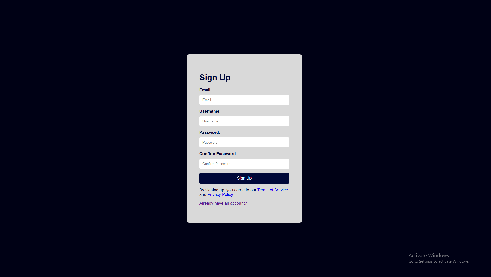
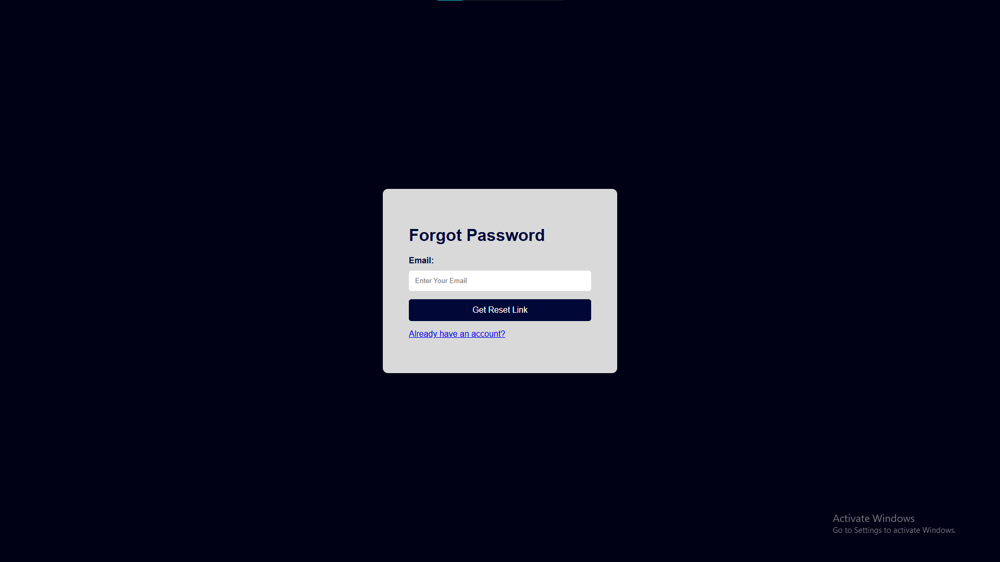

# 🔐 Simple Login UI – (Login | Signup | Forgot Password)

This is a beginner-friendly **Authentication UI project** that demonstrates the fundamentals of **HTML**, **CSS**, and **JavaScript**. It includes a clean, responsive design for Login, Signup, and Forgot Password pages with basic JavaScript-based interaction and validation.

---

## 🚀 Features

- ✅ **Login Page** with email & password fields
- ✅ **Signup Page** with basic form layout
- ✅ **Forgot Password Page** with JS-based feedback
- 📱 Responsive design for mobile and desktop
- 🧠 JavaScript DOM manipulation and form validation
- ❌ No backend – front-end UI only

---

## 📸 Preview

- **Login Page**
 

- **Sign Up Page**
- 

- **Forgot Password Page**
 

---

## 🛠 Tech Stack

- **HTML5**
- **CSS3**
- **JavaScript**

---

## 📜 License

This project is licensed under the [MIT License](LICENSE).

---

## 🙌 Author

Made with ❤️ by [Deepak Thiagarajan](https://github.com/Deeps1970)

---

## 📬 Contact

Feel free to connect or reach out:

- 📧 Email: [thiagarajandeepu2007@gmail.com](mailto:thiagarajandeepu2007@gmail.com)
- 💼 LinkedIn: [linkedin.com/in/deepakthiagarajan](https://www.linkedin.com/in/deepak1970)  
- 🐙 GitHub: [github.com/Deeps1970](https://github.com/Deeps1970)
- 📷 Instagram: [_.cltchr7._](https://www.instagram.com/_.cltchr7._/)
